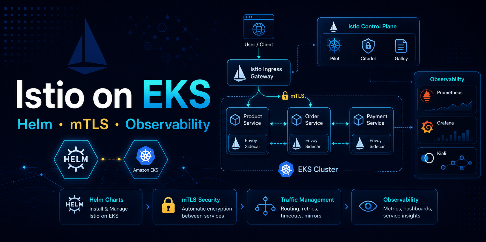

# Istio Helm on EKS Guide

EKS에서 공식 Helm Chart로 Istio를 설치하고 트래픽 라우팅, mTLS, 관측성, 트러블슈팅을 실습하는 예제입니다.

> 이 저장소는 블로그 시리즈를 위한 **학습용 샘플**입니다. 완성형 프로덕션 플랫폼이 아닙니다. Helm 기반 설치 워크플로우와 실전 운영에 집중합니다.

---

## 📎 관련 아티클

1. [Istio란 무엇인가: Kubernetes 서비스 메시 구성요소와 트래픽 흐름 이해하기](https://tistory-cloud.tistory.com/entry/Istio%EB%9E%80-%EB%AC%B4%EC%97%87%EC%9D%B8%EA%B0%80-Kubernetes-%EC%84%9C%EB%B9%84%EC%8A%A4-%EB%A9%94%EC%8B%9C-%EA%B5%AC%EC%84%B1%EC%9A%94%EC%86%8C%EC%99%80-%ED%8A%B8%EB%9E%98%ED%94%BD-%ED%9D%90%EB%A6%84-%EC%9D%B4%ED%95%B4%ED%95%98%EA%B8%B0)
2. [Istio Helm Chart 설치 방법: EKS에서 base, istiod, gateway 구성하기](https://tistory-cloud.tistory.com/entry/Istio-Helm-Chart-%EC%84%A4%EC%B9%98-%EB%B0%A9%EB%B2%95-EKS%EC%97%90%EC%84%9C-base-istiod-gateway-%EA%B5%AC%EC%84%B1%ED%95%98%EA%B8%B0)
3. [Istio Canary 배포 방법: VirtualService와 DestinationRule로 트래픽 나누기](https://tistory-cloud.tistory.com/entry/Istio-Canary-%EB%B0%B0%ED%8F%AC-%EB%B0%A9%EB%B2%95-VirtualService%EC%99%80-DestinationRule%EB%A1%9C-%ED%8A%B8%EB%9E%98%ED%94%BD-%EB%82%98%EB%88%84%EA%B8%B0)
4. [Istio mTLS 설정 방법: PeerAuthentication과 AuthorizationPolicy로 서비스 간 통신 보호하기](https://tistory-cloud.tistory.com/entry/Istio-mTLS-%EC%84%A4%EC%A0%95-%EB%B0%A9%EB%B2%95-PeerAuthentication%EA%B3%BC-AuthorizationPolicy%EB%A1%9C-%EC%84%9C%EB%B9%84%EC%8A%A4-%EA%B0%84-%ED%86%B5%EC%8B%A0-%EB%B3%B4%ED%98%B8%ED%95%98%EA%B8%B0)
5. [Istio 관측성 운영 방법: Prometheus, Grafana, Kiali로 서비스 메시 확인하기](https://tistory-cloud.tistory.com/entry/Istio-%EA%B4%80%EC%B8%A1%EC%84%B1-%EC%9A%B4%EC%98%81-%EB%B0%A9%EB%B2%95-Prometheus-Grafana-Kiali%EB%A1%9C-%EC%84%9C%EB%B9%84%EC%8A%A4-%EB%A9%94%EC%8B%9C-%ED%99%95%EC%9D%B8%ED%95%98%EA%B8%B0)
6. [Istio 트러블슈팅 가이드: 503 오류, mTLS, VirtualService, Sidecar 문제 해결하기](https://tistory-cloud.tistory.com/entry/Istio-%ED%8A%B8%EB%9F%AC%EB%B8%94%EC%8A%88%ED%8C%85-%EA%B0%80%EC%9D%B4%EB%93%9C-503-%EC%98%A4%EB%A5%98-mTLS-VirtualService-Sidecar-%EB%AC%B8%EC%A0%9C-%ED%95%B4%EA%B2%B0%ED%95%98%EA%B8%B0)

---

## ✅ 이 예제가 보여주는 것

- 공식 Helm Chart로 `base`, `istiod`, `gateway`를 분리 설치하는 방법
- Sidecar injection이 적용된 샘플 애플리케이션 배포
- Gateway, VirtualService, DestinationRule 예제
- Canary 및 헤더 기반 트래픽 라우팅
- mTLS와 AuthorizationPolicy 예제
- Prometheus, Grafana, Kiali 관측성 노트
- 자주 발생하는 Istio 장애 트러블슈팅 노트

## ❌ 이 예제가 하지 않는 것

- 전체 EKS 클러스터 프로비저닝을 포함하지 않습니다.
- 프로덕션 수준의 GitOps 파이프라인을 포함하지 않습니다.
- 조직별 보안 정책을 대신하지 않습니다.
- 완성형 모니터링 스택 설치를 포함하지 않습니다.
- 프로덕션 TLS 인증서 자동화를 포함하지 않습니다.

---

## 📁 폴더 구조

```text
charts-values/       base, istiod, gateway Helm values 예제
install/             Helm 설치 및 검증 스크립트
sample-app/          v1, v2, service, frontend 샘플 앱
traffic-routing/     Gateway, VirtualService, DestinationRule
mtls-security/       PeerAuthentication, AuthorizationPolicy, mTLS 정책
observability/       Prometheus, Grafana, Kiali 노트
troubleshooting/     자주 발생하는 장애 케이스와 명령
docs/                아키텍처 및 운영 노트
scripts/             저장소 검증 스크립트
```

---

## 🚀 빠른 시작

**1. Istio Helm으로 설치**

```bash
chmod +x install/*.sh
./install/01-add-helm-repo.sh
./install/02-install-base.sh
./install/03-install-istiod.sh
./install/04-install-gateway.sh
./install/05-verify.sh
```

직접 Helm 명령으로 실행하는 경우:

```bash
helm repo add istio https://istio-release.storage.googleapis.com/charts
helm repo update

helm upgrade --install istio-base istio/base \
  -n istio-system --create-namespace \
  -f charts-values/istio-base-values.yaml --wait

helm upgrade --install istiod istio/istiod \
  -n istio-system \
  -f charts-values/istiod-values.yaml --wait

helm upgrade --install istio-ingress istio/gateway \
  -n istio-ingress --create-namespace \
  -f charts-values/istio-gateway-values.yaml --wait
```

**2. 샘플 앱 배포**

```bash
kubectl apply -f sample-app/namespace.yaml
kubectl apply -f sample-app/serviceaccount-frontend.yaml
kubectl apply -f sample-app/app-v1.yaml
kubectl apply -f sample-app/app-v2.yaml
kubectl apply -f sample-app/service.yaml
kubectl apply -f sample-app/frontend.yaml
```

Sidecar injection 확인:

```bash
kubectl get pods -n istio-sample
kubectl get pod -n istio-sample -l app=httpbin \
  -o jsonpath='{.items[0].spec.containers[*].name}'
```

**3. 트래픽 라우팅 적용**

```bash
kubectl apply -f traffic-routing/gateway.yaml
kubectl apply -f traffic-routing/destinationrule.yaml
kubectl apply -f traffic-routing/virtualservice-canary.yaml
```

**4. mTLS 및 인가 정책 적용**

테스트 네임스페이스에서 먼저 적용하세요.

```bash
kubectl apply -f mtls-security/peerauthentication-strict.yaml
kubectl apply -f mtls-security/destinationrule-mtls.yaml
kubectl apply -f mtls-security/authorizationpolicy-allow-only-frontend.yaml
```

**5. 저장소 검증**

```bash
node scripts/validate-repo.mjs
```

---

## ⚠️ 사용 전 확인

- Kubernetes 또는 EKS 클러스터와 `kubectl`이 준비되어 있어야 합니다.
- `helm`이 설치되어 있어야 합니다.
- `istioctl`은 선택 사항이지만 `analyze`, `proxy-status` 확인에 유용합니다.
- Ingress Gateway를 `LoadBalancer`로 노출하려면 AWS Load Balancer Controller가 필요합니다.
- 공식 Istio Helm 설치는 `base`, `istiod`, `gateway`를 별도 차트로 관리합니다.
- `istioctl` 소유권과 Helm 소유권을 혼용하지 마세요.
- mTLS 정책은 단계적으로 적용하세요. 메시 전체 STRICT 모드 전에 네임스페이스 단위로 먼저 테스트하세요.

**트러블슈팅 첫 번째 명령**

```bash
istioctl analyze
istioctl proxy-status
kubectl get pods -n istio-system
kubectl get pods -n istio-ingress
kubectl logs -n istio-ingress deploy/istio-ingress -c istio-proxy
```

추가 트러블슈팅 노트는 `troubleshooting/`을 참고하세요.

---

## 📚 참고 문서

- [Istio install with Helm](https://istio.io/latest/docs/setup/install/helm/)
- [Istio gateway installation](https://istio.io/latest/docs/setup/additional-setup/gateway/)
- [Istio traffic management](https://istio.io/latest/docs/concepts/traffic-management/)
- [Istio security](https://istio.io/latest/docs/concepts/security/)
- [Istio observability](https://istio.io/latest/docs/concepts/observability/)

---

## License

MIT
