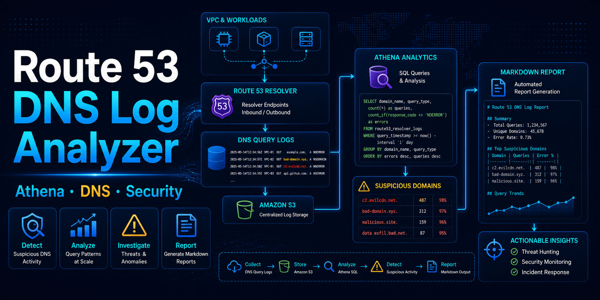

# Route 53 Resolver Query Log Analyzer

Route 53 Resolver Query Log를 Athena로 분석하고, 의심 도메인 조사용 Markdown 리포트를 생성하는 예제입니다.

> DNS 조회 로그는 실제 네트워크 접속을 확정하지 않습니다.  
> 다만 VPC 내부 워크로드가 어떤 도메인을 조회했는지 보여 주기 때문에, 의심 통신을 좁혀 가는 좋은 출발점이 됩니다.

---

## 📎 관련 아티클

- [우리 서버가 수상한 도메인을 조회했네: Route 53 Resolver DNS 로그 분석기 만들기](https://tistory-cloud.tistory.com/entry/%EC%9A%B0%EB%A6%AC-%EC%84%9C%EB%B2%84%EA%B0%80-%EC%88%98%EC%83%81%ED%95%9C-%EB%8F%84%EB%A9%94%EC%9D%B8%EC%9D%84-%EC%A1%B0%ED%9A%8C%ED%96%88%EB%84%A4-Route-53-Resolver-DNS-%EB%A1%9C%EA%B7%B8-%EB%B6%84%EC%84%9D%EA%B8%B0-%EB%A7%8C%EB%93%A4%EA%B8%B0)

---

## ✅ 이 예제가 보여주는 것

- 어떤 인스턴스가 어떤 도메인을 조회했는지 파악하는 방법
- `NXDOMAIN` 급증, 긴 도메인, 과도한 `TXT` 쿼리 탐지 방법
- 알려진 의심 도메인 룰셋과 조회 로그를 매칭하는 방법
- Athena 쿼리 결과를 Markdown 리포트로 자동 생성하는 방법

---

## 📁 폴더 구조

```text
athena/      Athena 테이블 생성 SQL과 예제 탐지 쿼리
src/         Markdown 리포트 생성 스크립트
rules/       간단한 도메인 룰셋
sample-data/ 샘플 로그와 예제 Athena 결과
reports/     예제 출력 리포트
```

---

## 🚀 빠른 시작

**1. Athena 테이블 생성**

[`athena/create_table.sql`](athena/create_table.sql)에서 아래 값을 환경에 맞게 교체 후 Athena에서 실행합니다.

- `YOUR_BUCKET`
- `YOUR_ACCOUNT_ID`
- `vpc-xxxxxxxx`
- `projection.date.range`

**2. 탐지 쿼리 실행**

[`athena/example_queries.sql`](athena/example_queries.sql)에서 필요한 쿼리를 실행하고 결과를 CSV로 내려받습니다.

**3. 리포트 생성**

```bash
python src/generate_report.py \
  --input sample-data/athena_result_sample.csv \
  --rules rules/suspicious_domains.txt \
  --output reports/example_report.md
```

예제 출력은 [`reports/example_report.md`](reports/example_report.md)에서 확인할 수 있습니다.

---

## ⚠️ 사용 전 확인

- DNS 조회가 실제 접속을 의미하지는 않습니다.
- Resolver 캐시로 처리된 반복 조회는 로그에 남지 않을 수 있습니다.
- 긴 도메인이나 `TXT` 쿼리는 정상 서비스에서도 나타날 수 있습니다.
- 로그에는 내부 자산 정보가 포함될 수 있으므로 보존 기간과 접근 권한을 함께 설계하세요.

---

## 📚 참고 문서

- [Route 53 Resolver Query Logging](https://docs.aws.amazon.com/Route53/latest/DeveloperGuide/resolver-query-logs.html)
- [Values that appear in VPC Resolver query logs](https://docs.aws.amazon.com/Route53/latest/DeveloperGuide/resolver-query-logs-format.html)
- [Create the table for resolver query logs](https://docs.aws.amazon.com/athena/latest/ug/querying-r53-resolver-logs-creating-the-table.html)
