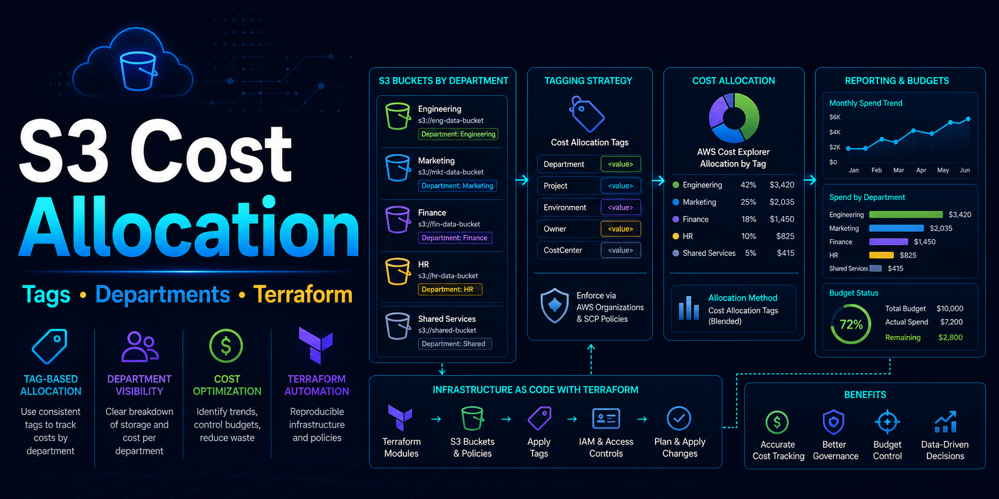

# S3 Cost Allocation by Department

부서별 S3 비용을 명확하게 귀속하기 위한 Terraform 샘플입니다.

> S3 비용 최적화의 시작은 삭제가 아니라 비용 귀속입니다.  
> Access Point는 접근 제어를 나누는 도구이고, 비용 귀속의 기본 단위는 버킷과 Cost Allocation Tag입니다.

---

## 📎 관련 아티클

- [S3 비용이 어디서 나오는지 모를 때: 버킷 태그와 Cost Allocation Tag로 부서별 비용 추적하기](https://tistory-cloud.tistory.com/entry/S3-%EB%B9%84%EC%9A%A9%EC%9D%B4-%EC%96%B4%EB%94%94%EC%84%9C-%EB%82%98%EC%98%A4%EB%8A%94%EC%A7%80-%EB%AA%A8%EB%A5%BC-%EB%95%8C-%EB%B2%84%ED%82%B7-%ED%83%9C%EA%B7%B8%EC%99%80-Cost-Allocation-Tag%EB%A1%9C-%EB%B6%80%EC%84%9C%EB%B3%84-%EB%B9%84%EC%9A%A9-%EC%B6%94%EC%A0%81%ED%95%98%EA%B8%B0)

---

## ✅ 이 예제가 보여주는 것

- 부서별 버킷 분리 예제
- `Department`, `Environment`, `CostCenter` 태그 설계
- Terraform으로 반복 가능한 S3 버킷 생성
- Access Point와 비용 추적을 혼동하지 않기 위한 설명

## ❌ 이 예제가 하지 않는 것

- 실제 조직의 완성형 FinOps 표준을 대신하지 않습니다.
- 공유 버킷 안의 객체별 비용을 자동으로 회계 분리하지 않습니다.
- Access Point 태그만으로 부서별 S3 비용을 분리한다고 가정하지 않습니다.

---

## 📁 폴더 구조

```text
terraform/      공통 Terraform 샘플 코드
examples/       부서별 tfvars 샘플
access-point/   Access Point를 어디에 써야 하는지 설명
```

---

## 🚀 빠른 시작

```bash
cd terraform
terraform init
terraform plan -var-file=../examples/marketing.tfvars
```

샘플을 실제로 배포하려면 `plan` 결과를 검토한 뒤 아래 명령을 사용합니다.

```bash
terraform apply -var-file=../examples/marketing.tfvars
```

같은 코드에 다른 변수 파일을 넣으면 `dev`, `data` 버킷도 같은 방식으로 만들 수 있습니다.

---

## ⚠️ 사용 전 확인

- AWS Billing에서 사용자 정의 Cost Allocation Tag를 활성화해야 Cost Explorer에서 사용할 수 있습니다.
- 태그는 활성화 후의 비용 분류에만 적용되므로, 과거 비용을 소급 정리하는 도구로 보면 안 됩니다.
- 요청 비용, 데이터 전송, 스토리지 클래스 비용을 함께 봐야 실제 S3 비용 구조를 이해할 수 있습니다.
- 샘플 버킷 이름은 전역 고유해야 하므로, 조직 규칙에 맞게 변경하세요.

---

## 📚 참고 문서

- [Using cost allocation S3 bucket tags](https://docs.aws.amazon.com/console/s3/cost-allocation-tagging)
- [Tagging for cost allocation or ABAC](https://docs.aws.amazon.com/AmazonS3/latest/userguide/tagging.html)
- [Managing access to shared datasets with access points](https://docs.aws.amazon.com/AmazonS3/latest/userguide/access-points.html)
